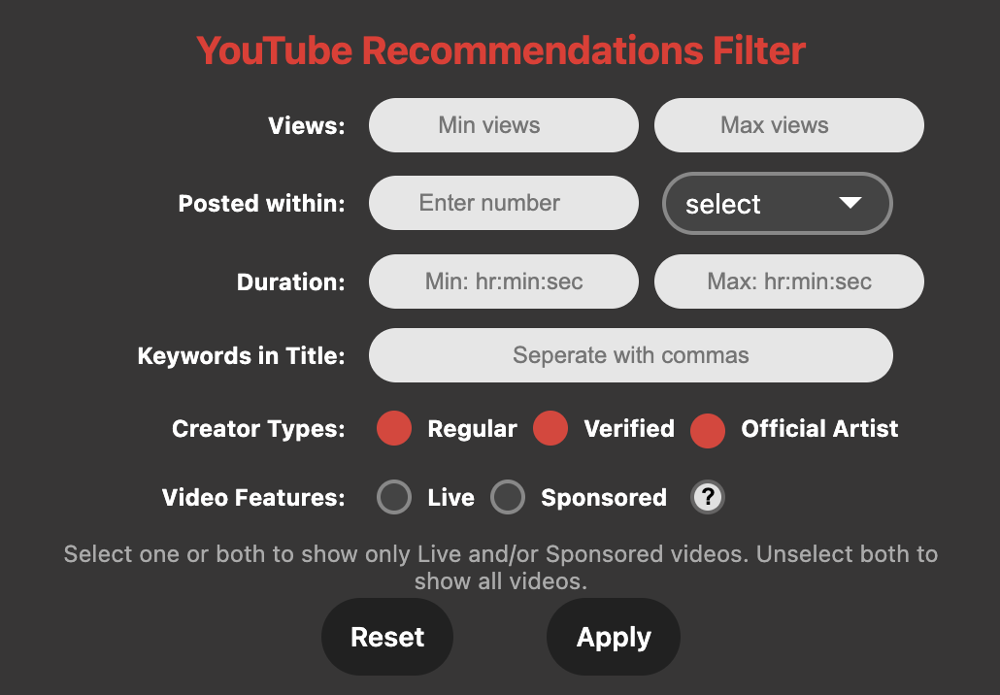

# YouTube Recommendations Filter 

Chrome extension to dynamically filter YouTube homepage videos and recommendations. Created with Javascript and HTML/CSS.

  

## Table of Contents
* [Introduction](#general-info)
* [Technologies](#technologies)
* [Setup Instructions](#setup)
* [Demo](#demo)
* [Filter Options](#filter-options)
* [To-do](#to-do)

## Introduction
While YouTube is my go-to platform for entertainment and news, its homepage can often feel cluttered with content I'm not interested in. Although there's a video filter feature on the search results page, it's missing from the homepage. This Chrome extension allows you to filter your recommended videos, helping you quickly discover content that interests you.

This extension is just a side project after noticing a gap on YouTube's platform. It's also helped me practice JavaScript. It's still in development and I'm working on adding new features!

## Technologies
Project created with:
* JavaScript
* HTML/CSS

## Setup Instructions
The filter isn't on the Chrome Web Store yet, but you can use it by loading the extension unpacked in developer mode on Chromium browsers.

1. Download and unzip the extension from this repository page: Green "Code" button > Download ZIP
2. Go to chrome://extensions/ 
3. Turn on Developer mode.
4. Load unpacked extension and select the unzipped folder.
5. Click on the extension icon to set filters. Tip: Pin it for easy access.

## Demo

 

  

 

|  |  |
|:-------------------------------------------------:|:--------------------------------------------------:|
| **Live and Sponsored:** Shows only Live and/or Sponsored videos if checked; shows all if neither is selected. | **Invalid Input:** Shown when a filter input is not in the correct format or out of range. |

## Filter Options
Extension allows video filtering by:
* Number of views
* Post date
* Duration of video
* Keywords in video title
* Creator types (Regular, Verfified, Official Artist)
* Video features (Live, Sponsored)

## To-do
Upcoming features are:
* Filter for more video features (playlists, movies)
* Filter for creators by name
* Support for filtering YouTube Shorts

## Troubleshooting
The extension does not yet support the following YouTube features and will hide them from view when the extension is running:
* YouTube Shorts
* Sponsored button will not work if an ad-blocker is running
