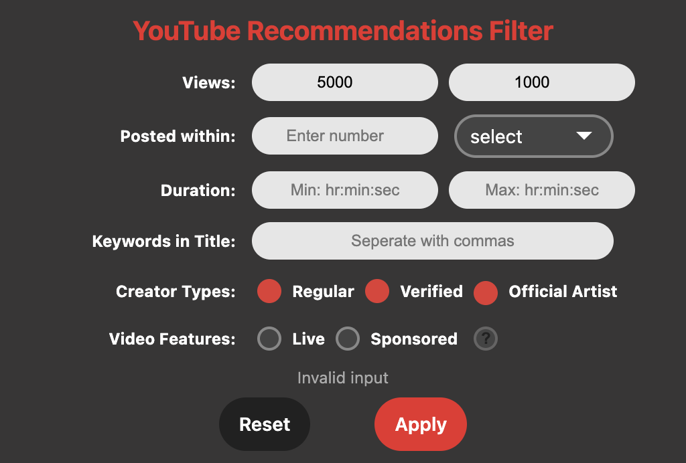

# YouTube Recommendations Filter

Chrome extension that adds feed-level filtering to YouTube so you can keep recommendation pages focused on the videos you actually want to see.

  

## Overview

YouTube offers filtering on some search surfaces, but not on the main recommendation feeds where most browsing happens. This project fills that gap by applying user-defined rules directly to supported YouTube feed pages.

The extension currently supports filtering by:

- Minimum and maximum views
- Post age
- Minimum and maximum duration
- Keywords in the video title
- Creator type: Regular, Verified, Official Artist
- Video attributes: Live, Sponsored

## Supported Pages

The extension is intentionally scoped to YouTube Home page.

Other YouTube surfaces such as Shorts, search results, and watch-page sidebars are out of scope for this version.

## Demo

  

|  |  |
|:------------------------------------------------------------------------------:|:---------------------------------------------------------------------------------:|
| **Live and Sponsored:** If either option is enabled, the feed only keeps cards that match the selected feature filters. | **Invalid Input:** The popup validates user input and blocks invalid ranges or formats before applying filters. |

## Tech Stack

- JavaScript
- HTML/CSS
- WebExtensions API (Manifest V3 — Chrome/Chromium; Manifest V2-compatible via `browser_specific_settings` for Firefox)

## Local Setup

**Chrome / Chromium**

1. Clone or download this repository.
2. Open `chrome://extensions/` in Chrome or another Chromium-based browser.
3. Enable Developer mode.
4. Click `Load unpacked` and select this project folder.
5. Pin the extension so the popup is easy to access while browsing YouTube.

**Firefox**

1. Clone or download this repository.
2. Open `about:debugging#/runtime/this-firefox` in Firefox.
3. Click `Load Temporary Add-on...` and select the `manifest.json` file inside the project folder.
4. The extension will stay loaded until Firefox is closed.

## Known Limitations

- The extension depends on YouTube's DOM structure, so selector maintenance is occasionally required when YouTube updates its markup.
- Shorts are not supported by this version of the extension.
- Sponsored detection may be incomplete when an ad blocker removes the label before the content script sees it.
- The extension is designed for supported feed pages only and will not filter every YouTube surface.

## Roadmap

- Add support for more video features such as playlists or movies
- Add creator-name filtering
- Add AI-powered thumbnail analysis and filtering based on thumbnail content
